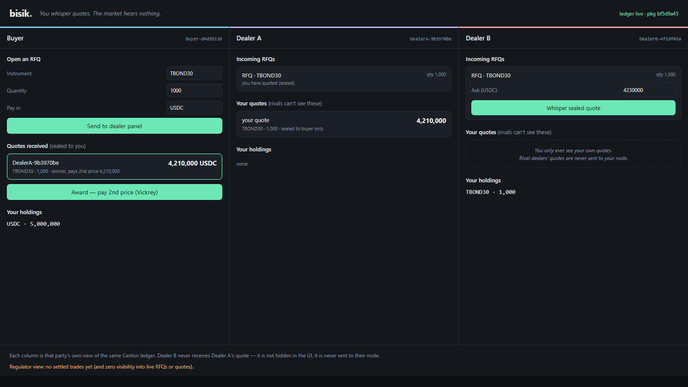
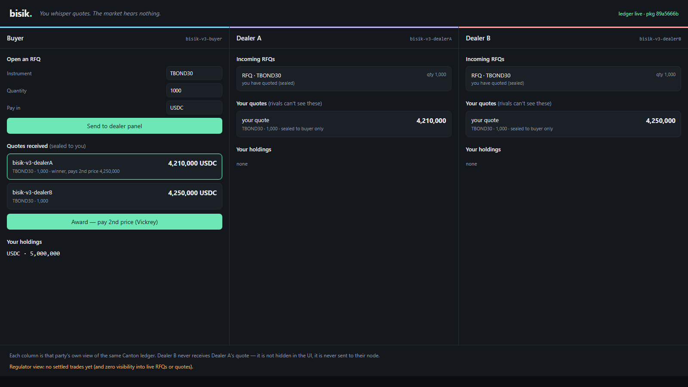

# Bisik

[](https://github.com/PugarHuda/bisik/actions/workflows/ci.yml)

> *bisik* — Indonesian for "whisper". You whisper quotes. The market hears nothing.

**Bisik is a confidential multi-dealer RFQ desk for OTC block trades, built native on the Canton Network.** A buyer requests quotes from a chosen dealer panel; each dealer's quote is sealed — competing dealers never receive it, the market never sees the RFQ, and the losing quotes are archived without ever being revealed. Settlement is atomic delivery-versus-payment at a Vickrey (second-price) clearing price. A regulator observes executed trades — and only executed trades.

Built for the **Build on Canton Hackathon** (Encode Club × Canton Foundation, 2026) — Private DeFi & Capital Markets track.

## The fifth implementation — and the first native one

We have built this exact product thesis four times, on four chains, each time fighting the chain's transparency with heavy machinery:

| Project | Chain | Privacy machinery we had to build |
|---|---|---|
| [Diam](https://github.com/PugarHuda/diam) | Arbitrum (iExec Nox) | TEE-based confidential compute, encrypted handles |
| [Segel](https://github.com/PugarHuda/segel) | Stellar (Soroban) | Two Circom/Groth16 ZK circuits, hand-rolled Poseidon |
| [Sealed Pair](https://github.com/PugarHuda/sealed-pair) | Sui | Walrus blob commitments + Seal threshold encryption |
| [Samar](https://github.com/PugarHuda/samar-confidential-otc) | Ethereum (Zama fhEVM) | FHE, branchless `FHE.select` settlement |
| **Bisik** | **Canton** | **None. Sub-transaction privacy is the ledger model.** |

On Canton, "dealer B cannot see dealer A's quote" is not a cryptographic achievement — it is a `signatory`/`observer` declaration. The Daml model below is the entire privacy layer.

## How it works

```
template RFQ             signatory buyer, observer invitedDealers
                         — the market never sees it; no price; optional deadline
choice   SubmitQuote     dealer locks the asset into escrow + seals a quote
                         — rejected once the ledger passes the RFQ's deadline
template Quote           signatory dealer, buyer — NO other observers
                         — competing dealers never RECEIVE it (physically, not by policy)
template EscrowedHolding signatory issuer+dealer, observer buyer
                         — asset locked while the quote is live; dealer can't double-sell
choice   Award           cheapest ask wins, paid the SECOND-cheapest price (Vickrey);
                         atomic DvP: cash→dealer + escrowed asset→buyer in one tx;
                         losing quotes archived + escrow returned, never revealed
template TradeReport     observer regulator — post-trade only; pre-trade stays dark
```

Why Vickrey? Dealers can quote their true reserve price without shading — the winner is paid the runner-up's price. Fair price discovery *requires* sealed bids; on a transparent chain this needs ZK or FHE. Here it is ~40 lines of Daml.

## Layout

Two packages, so the deployable model DAR carries no test/script code:

```
daml/Bisik.daml           model — the whole product (bisik-otc-0.6.0.dar → deploy this)
test/daml/BisikTest.daml  end-to-end script + privacy assertions
test/daml/Init.daml       on-ledger seed: parties + an open RFQ (LocalNet/Devnet demo)
web/                      the desk UI: 3 party views + JSON Ledger API proxy (Node stdlib)
mcp/                      read-only MCP server — the desk as AI-native tools
multi-package.yaml        workspace
```

## Hosted demo (live Devnet, read-only)

**[bisik-eight.vercel.app](https://bisik-eight.vercel.app)** — a landing page → **Open the
desk** ([/app](https://bisik-eight.vercel.app/app)) serves the desk over live Canton
Devnet state. All three party views are real: the buyer sees both sealed quotes, each
dealer sees only its own, the regulator sees nothing pre-trade. Hosted via a serverless
proxy that forwards **reads only** (the privileged token stays server-side); command
submission is disabled on the public URL. To drive the full flow yourself, run it locally:

The sidebar carries four read views over the same live ledger: **Verify privacy** (a
live count of what each node actually holds + a "what a transparent chain would leak"
contrast), **Best execution** (10 green attestations proving, from selectively-disclosed
asks, that the buyer beat every competitor — across the Vickrey, direct-OTC and
partial-fill rails, with no public order book), **Audit trail** (the regulator's settled
record + disclosures), and **Portfolio** (holdings per party). Every model choice —
award, partial-Vickrey, direct-OTC, partial fill, selective disclosure (buyer *and*
dealer), withdraw, reject, cancel, baskets — is drivable in the local desk.

## Live demo (local ledger)

One command boots a Canton sandbox, seeds it, and serves the desk. Requires the
Daml SDK 3.4 (`daml`), Java 21, and Node ≥ 20.

```bash
npm run demo          # build → sandbox → seed (holdings) → desk at http://localhost:8080
npm run demo:full     # same, but pre-seeds an RFQ + two sealed quotes
npm run record        # drive the money shot with Playwright → media/ screenshots + video
```

<p align="center"></p>

Or run the three pieces by hand:

```bash
daml build --all
daml sandbox --dar .daml/dist/bisik-otc-0.6.0.dar --json-api-port 7575
daml script --dar test/.daml/dist/bisik-test-0.1.0.dar \
  --script-name Init:initialize --ledger-host localhost --ledger-port 6865
cd web && npm start
```

The three columns are the same ledger seen by Buyer, Dealer A, and Dealer B.
Watch Dealer B's column while Dealer A whispers a quote: nothing appears — the
quote is never sent to Dealer B's node. Then Buyer awards and the Vickrey price
settles atomically. Point the UI at Devnet instead by setting
`LEDGER_JSON_URL` before `npm start`.

## Run it

```bash
daml build --all    # bisik-otc-0.6.0.dar (model) + bisik-test-0.1.0.dar
cd test && daml test # testBisik: mint → RFQ → sealed quotes → Vickrey DvP
                     # + privacy assertions (dealer B cannot query dealer A's quote)
```

## Deployed live on Canton Devnet ✅

Running on the shared 5N hackathon validator (Canton **3.5.8**), via the JSON
Ledger API. A one-file deployer (`scripts/devnet.mjs`, Node stdlib) uploads the
DAR, allocates + grants parties, and seeds a live RFQ with two sealed quotes.

```bash
cp scripts/.env.devnet.example scripts/.env.devnet   # fill client secret (Encode #general)
node scripts/devnet.mjs upload .daml/dist/bisik-otc-0.6.0.dar
node scripts/devnet.mjs seed        # parties + holdings + RFQ + 2 sealed quotes
node scripts/devnet.mjs verify      # prints per-party visibility (the privacy proof)
# then serve the UI against Devnet — the server reads the gitignored env file, so
# the secret never touches the command line, and binds loopback only:
cd web && LEDGER_ENV_FILE=../scripts/.env.devnet npm start
```

<p align="center"></p>
<p align="center"><em>The desk reading live Canton Devnet — real party IDs. Each dealer sees only its own sealed quote.</em></p>

**Live deployment facts**
- Ledger API: `https://ledger-api.validator.devnet.sandbox.fivenorth.io`
- Model package id (`bisik-otc` v0.6.0): `b0058535e188b74314740b6d3b1da1d59df999cdd41dac37ef61da23bcd15a30`
- Parties (shared namespace `…::1220a14ca128…`): `bisik-v6-buyer`, `bisik-v6-dealerA`,
  `bisik-v6-dealerB`, `bisik-v6-regulator`, `bisik-v6-cashissuer`, `bisik-v6-bondissuer`
- On-ledger `verify` result — Dealer A and Dealer B each see **only their own**
  Quote; the Regulator sees nothing pre-trade. Privacy proven on Devnet, not sandbox.

`verify` on Devnet prints:
```
buyer      {"Holding":25,"TradeReport":11,"BasketTradeReport":3,"RFQ":4,"EscrowedHolding":8,"Quote":8} quotes from: bisik-v6-dealerA,bisik-v6-dealerB (×4 each)
dealerA    {"Holding":17,"TradeReport":11,"BasketTradeReport":3,"RFQ":4,"EscrowedHolding":4,"Quote":4} quotes from: bisik-v6-dealerA (only its own)
dealerB    {"Holding":5,"RFQ":4,"EscrowedHolding":4,"Quote":4} quotes from: bisik-v6-dealerB (only its own)
regulator  {"TradeReport":11,"BasketTradeReport":3}   (settled trades only — zero pre-trade)
```

## Agentic access (MCP) — Private DeFi × agentic commerce

Bisik ships an [MCP](https://modelcontextprotocol.io) server (`mcp/`) that exposes
the live desk to AI agents. The compelling part: an agent can **verify Canton's
privacy model for itself** — and **act on the desk**, not just read it.

```
agent → party_view("dealerA")  → {"RFQ":1,"EscrowedHolding":1,"Quote":1}  (only its own quote)
agent → party_view("regulator") → {}  (nothing pre-trade)
agent → list_settlements        → the post-trade audit trail
agent → best_execution          → executed price vs the disclosed asks — attested
agent → post_rfq(TBOND30 ×1000) → posts a real RFQ on-ledger; live on the desk in seconds
```

Tools: `explain_desk`, `party_view`, `list_settlements`, `market_snapshot`,
`best_execution` (read), and `post_rfq` (**write** — an agent initiates a real
commercial action, using the operator's local credentials; the public hosted proxy
stays read-only). Drop `.mcp.json` into Claude Desktop / Cursor, or
`cd mcp && npm install && npm start`. See `mcp/README.md`.

And the *acting* side — **autonomous market-maker agents** (`scripts/agent.mjs`):
software agents, acting as dealers, watch the ledger for RFQs they're invited to
and auto-submit a sealed quote priced by their own rule. Each only ever sees its
own invitations (Canton privacy), so it quotes **blind**, like a real market
maker — it can't peek at rival quotes. The demo runs a **complete commercial
round-trip between agents**: two dealer-agents quote at different markups, a
buyer-agent reads the sealed quotes and awards, and the on-ledger `Award` choice
clears at the **Vickrey (second) price** — settling a real `TradeReport` on
Devnet. No party ever sets the clearing price by hand; the agents coordinate it.

```bash
npm run agent:demo   # posts an RFQ, two agents quote, a buyer-agent awards + settles
# → two agents negotiated and settled a real trade on-ledger:
#   · MarketMaker A asked 4,233,600 (+0.80%) — won
#   · MarketMaker B asked 4,258,800 (+1.40%) — runner-up
#   · cleared at 4,258,800 = the SECOND price (Vickrey), not the winner's ask
#   · TradeReport 0016f9c711… now on the regulator's ledger
# On Devnet: BISIK_PKG=<pkgid> LEDGER_ENV_FILE=scripts/.env.devnet node scripts/agent.mjs demo
```

Together these span two hackathon themes on one confidential ledger: Private DeFi
and agentic commerce with privacy — agents that both *read* (verify privacy) and
*act* (quote, award, settle a real trade) on a market where they structurally
cannot see their rivals.

## Honest scope

Bisik's buyer is the **auctioneer** — because of the privacy model, only the buyer
sees all the sealed quotes, so only the buyer can run the auction. The contract
enforces the guarantees that protect the *other* parties, and is honest about what
it leaves to the trusted auctioneer:

- **Enforced on-ledger:** rival dealers never receive each other's quotes; a
  winning dealer is never paid below their ask; the asset and cash move atomically
  (DvP) or not at all; the escrowed asset can't be pulled back unilaterally by the
  dealer; a quote can only settle the RFQ it was made against; the asset/cash
  issuer is checked against the RFQ's expected issuers.
- **Two settlement mechanisms, by design** (three rails counting partial fills):
  competitive `Award` (Vickrey second price) and direct bilateral OTC (settle one
  dealer at its own ask), each settleable full or partial. The invariant is that a
  dealer is **never paid below its own ask** (`SettleQuote` asserts `clearingPrice >=
  price`); a dealer may hold only one quote in an auction (enforced on-ledger in
  `Award`). Because the buyer curates the awarded quote set, it *can* suppress the
  Vickrey uplift — award a subset so the winner clears at its own ask rather than the
  true second price — so the guarantee is "at or above the winner's ask," not the full
  Vickrey optimum. Forcing the *true* second price with full-set inclusion needs a
  trusted auctioneer or MPC; that is future work (and MPC would re-introduce exactly
  the cryptography Canton lets us skip).
- The desk's legs use a self-contained `Holding` token with issuer binding (plus a
  CIP-0056-aligned `Token` interface). A fuller, **CIP-0056-shaped token standard is
  now implemented and live on Devnet** as a separate package (`token-standard/`,
  package `05e4ebb9…`): a `Holding` interface + a two-step `TransferInstruction` +
  an `Allocation` for atomic DvP, each threading a `Metadata` map — verified on-ledger
  (`npm run token:demo`) and by four `daml test` scripts. Full cross-package registry
  interop (external-wallet `TransferFactory`/`AllocationFactory` discovery via the
  Splice DARs) is the remaining step; the on-ledger *shape* of the standard is done.
- Single-round sealed bids. **Partial fills are supported** on both rails
  (`AcceptPartial` for direct OTC, `AwardPartial` for Vickrey — prorated).
  **Multi-instrument baskets are supported** (a BasketRFQ settles several legs +
  cash atomically; driveable in the desk). Multi-round bidding is via dealer
  withdraw + re-quote.

See `QA.md` for the full multi-angle review (bugs fixed, accepted scope, opportunities).

## Submission assets

- **Pitch deck** — `slides/index.html` (open in a browser; arrow keys to navigate, print → PDF to export)
- **Demo storyboard** — `DEMO-SCRIPT.md` (3-min video, the money shot beat by beat)
- **Screen capture** — `media/` (per-step screenshots + a silent video to narrate over)
- **Deck outline** — `DECK.md`
- **QA & review notes** — `QA.md` (multi-angle review: bugs fixed, accepted scope, opportunities)
- **Submission answers** — `SUBMISSION.md` (ready-to-paste form answers + judging-criteria map)

## License

Apache-2.0
